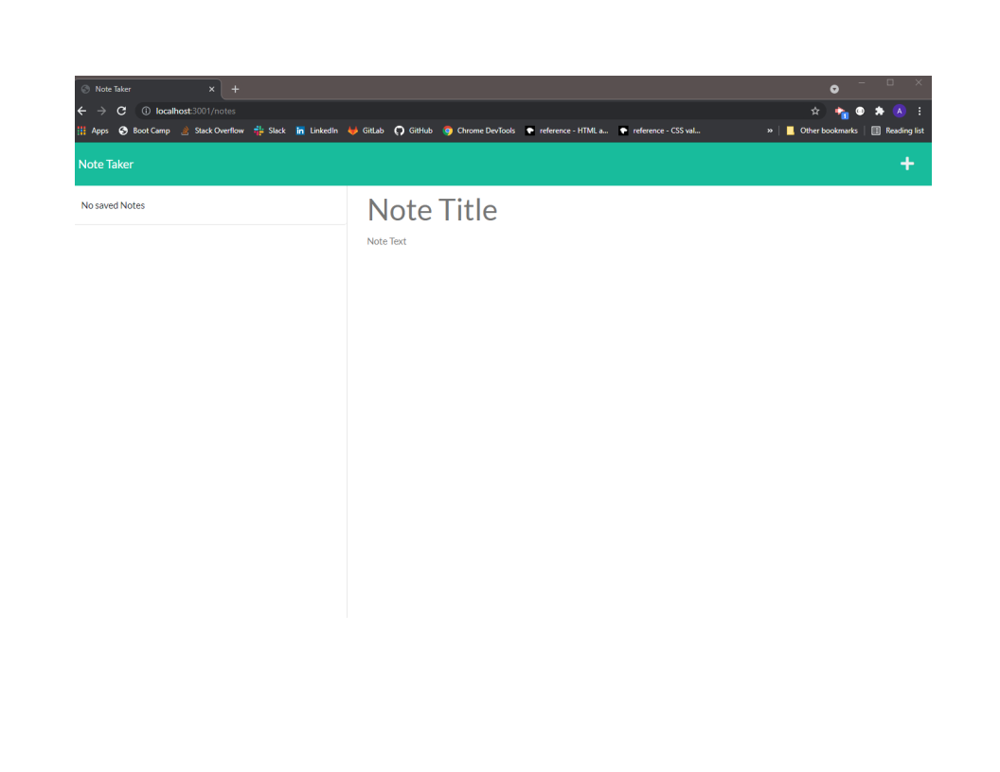

# Note Taker

## Description 

Express.js Challenge: Note Taker
Challenge Elements
The challenge is to create an application called Note Taker that can be used to write and save notes. This application will use an Express.js back end and will save and retrieve note data from a JSON file.

The application’s front end has already been created. It's a job to build the back end, connect the two, and then deploy the entire application to Heroku.

## Installation

The project can be viewed at: https://AWiebe2021.github.io/Weather-Dashboard/
The projects code can be accessed at: https://github.com/AWiebe2021/Weather-Dashboard/

## Screenshot

## Credits
Solo project this week